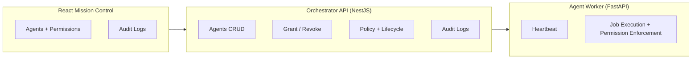

# Jarvis AI Orchestration Platform (MVP)

This repo contains a Jarvis-like agent orchestration control plane with a TypeScript API, a Python agent worker, and a React mission-control UI.

## Architecture



## Monorepo layout

- `apps/web`: React mission control UI.
- `services/orchestrator`: NestJS control plane API with Prisma persistence.
- `services/agent-worker`: FastAPI agent worker service.
- `packages/shared`: shared Zod schemas and types.

## Local development

### Prerequisites

- Node.js 20+
- Python 3.11+

### Setup

```bash
npm install
```

Initialize the database for the orchestrator:

```bash
cd services/orchestrator
cp .env.example .env
npm run prisma:generate
npm run prisma:migrate
```

### Run services

```bash
npm run dev -w @jarvis/orchestrator
npm run dev -w @jarvis/web
```

In another terminal, run the agent worker:

```bash
cd services/agent-worker
python -m venv .venv
source .venv/bin/activate
pip install -r requirements.txt
uvicorn app:app --reload --port 5001
```

### Docker Compose

```bash
docker compose up --build
```

- Orchestrator API: http://localhost:4000
- Swagger docs: http://localhost:4000/docs
- Web UI: http://localhost:5173
- Agent worker: http://localhost:5001

## Core API endpoints

- `POST /agents`
- `GET /agents`
- `GET /agents/:id`
- `PATCH /agents/:id`
- `DELETE /agents/:id`
- `POST /agents/:id/permissions/grant`
- `POST /agents/:id/permissions/revoke`
- `GET /audit`

## Lifecycle states

`CREATED -> RUNNING -> IDLE -> TERMINATED`

The control plane validates transitions to prevent invalid jumps.
