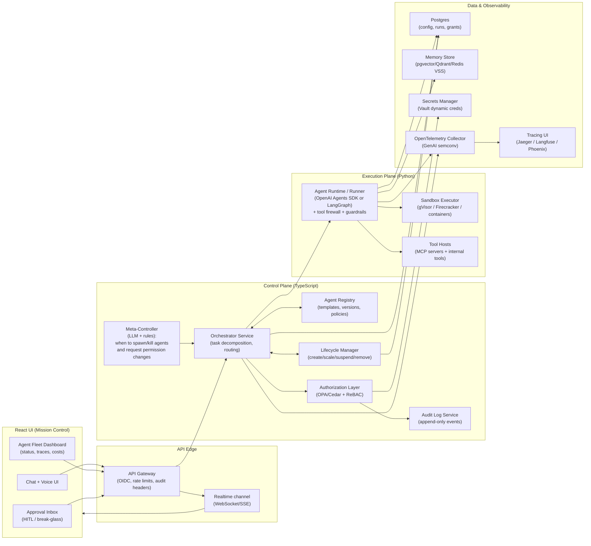
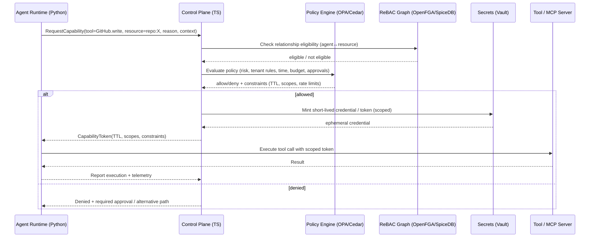

# Designing a Jarvis-Like Agent Orchestration Control Plane for Lifecycle and Dynamic Permissions

## Scope and design goals for a Jarvis-like orchestrator

A “Jarvis-style” agent orchestration tool is best understood as a **control plane** that manages a fleet of specialized “system agents” (workers) and their access to tools, data, and side effects. The distinctive requirement is not just multi-agent coordination, but **autonomous lifecycle management** (create / scale / suspend / remove agents) and **dynamic permissions** (grant, narrow, revoke) that adapt in real time as goals, context, and risk change.

Two trendlines strongly shape a modern design:

The first is the rise of **standardized tool and agent interoperability protocols**. The **Model Context Protocol (MCP)** defines a standard way to connect LLM applications to external tools/data via **JSON-RPC 2.0** and explicit roles (hosts, clients, servers), while emphasizing consent, privacy, and tool safety considerations. citeturn6view0turn17view0turn6view1 The **Agent2Agent (A2A)** protocol complements MCP by focusing on **agent-to-agent interoperability**, capability discovery via “Agent Cards,” task lifecycles, and long-running task support, built atop familiar standards like HTTP/SSE/JSON-RPC. citeturn18view0turn6view3turn6view2

The second trendline is that production-grade systems increasingly converge on **control-loop and durable-execution patterns**. Kubernetes formalizes control loops (“controllers”) that constantly reconcile actual state toward desired state, and operators extend Kubernetes with CRDs + controllers for domain-specific resources. citeturn4search0turn4search9turn4search1 For long-running, failure-resilient workflows, durable execution platforms like Temporal explicitly aim to make execution crash-proof by persisting progress and resuming. citeturn4search2turn4search6 These patterns map naturally onto “agent fleets” that must be observable, resumable, and safe.

## Survey of agent orchestration frameworks and open-source control planes

### Agent frameworks focused on multi-agent workflows, handoffs, and state

**OpenAI Agents SDK (Python + TypeScript)**  
OpenAI’s Agents SDK positions itself as a production-ready upgrade over Swarm, with a small primitive set: agents (instructions + tools), **handoffs** (agents as tools), and **guardrails** for input/output validation, plus built-in tracing to visualize/debug flows. citeturn11view0turn5search5turn5search2turn11view3 Its documentation explicitly distinguishes **LLM-driven orchestration** (the LLM decides which tools/handoffs to use) from **code-driven orchestration** (structured outputs + deterministic routing), and suggests mixing both patterns. citeturn16view0

**LangGraph (LangChain)**  
LangGraph describes itself as a low-level orchestration framework for building, managing, and deploying **long-running, stateful agents**, emphasizing durable execution, human-in-the-loop inspection, memory, and production deployment integration (via LangSmith tooling). citeturn11view1turn1search2turn1search22

**Microsoft Agent Framework (successor/unification of Semantic Kernel + AutoGen)**  
Microsoft Agent Framework is presented as an open-source kit for building agents and graph workflows, including sessions/state management, context providers, middleware, MCP clients, and workflow constructs like checkpointing and request/response patterns for human-in-the-loop scenarios. citeturn11view2turn0search5turn0search15

**AutoGen (Microsoft)**  
AutoGen is a long-standing open-source multi-agent framework; Microsoft’s later announcement notes it is maintained but positioned alongside the newer unified Microsoft Agent Framework. citeturn0search1turn0search15

**CrewAI**  
CrewAI is a popular Python framework for orchestrating role-based agents; its docs describe agents as autonomous units with tasks, tools, memory, and delegation. citeturn12view0turn12view1 (CrewAI also promotes a broader “control plane” offering, but that portion is not fully open-source in the same way as the core library.) citeturn12view1

**LlamaIndex Workflows / AgentWorkflow**  
LlamaIndex positions “Workflows” as an event-driven framework for orchestrating multi-step agentic systems; AgentWorkflow builds on those abstractions for coordinating agents and state. citeturn1search3turn1search15turn1search7

**Agno**  
Agno explicitly frames itself as a **framework + runtime + control plane**: a Python SDK, a production runtime, and an “AgentOS UI” control plane; it highlights support for MCP + A2A and human-in-the-loop as first-class features. citeturn10view3turn0search8

### Open-source “agent control planes” and orchestration systems with lifecycle focus

Several GitHub projects aim to provide the “mission control” layer you’re describing—often reflecting Kubernetes-like control planes, schedulers, or dashboards:

Agent-Field (“Kubernetes for AI Agents”) emphasizes agents as API endpoints, tracked calls visualized as DAGs, and “cryptographic identity” plus audit trails. citeturn10view0turn8search0  
HumanLayer’s Agent Control Plane describes itself as a Kubernetes-based orchestrator/scheduler for long-lived “outer-loop agents,” with MCP support and durability guarantees. citeturn10view1turn8search5  
Open Agent focuses on orchestrating coding-agent runtimes inside isolated Linux workspaces (systemd-nspawn), with a mission-control dashboard and a Git-backed library of skills/tools/rules/agents/MCP servers. citeturn10view2turn8search1  
Other emerging repos include AgentxSuite (unified interface across MCP servers), and “agent dashboard” style projects for visual orchestration. citeturn8search9turn8search28

### Standards and protocols that matter for messaging, tools, and remote agents

**MCP (Model Context Protocol)** defines standardized host↔server integration with resources/prompts/tools, and client features like sampling/roots/elicitation via JSON-RPC 2.0. citeturn6view0turn17view0 Its specification explicitly flags the security implications of arbitrary data access and code execution paths and calls for robust consent/authorization flows and cautious tool treatment. citeturn17view0turn6view1

**A2A (Agent2Agent)** defines agent interoperability: agents communicate and coordinate actions; A2A uses common standards (HTTP/SSE/JSON-RPC), supports long-running tasks with state updates, and explicitly “complements” MCP. citeturn18view0turn6view2turn6view3

### Comparative table of relevant open-source projects and frameworks

| Project / Framework | Primary role | Notable features for lifecycle & permissions | Strengths | Tradeoffs / gaps | Suitability for Jarvis-like control plane |
|---|---|---|---|---|---|
| OpenAI Agents SDK (Python/TS) | Agent runtime + multi-agent orchestration primitives | Agents, handoffs, guardrails, tracing; explicit patterns for LLM- vs code-orchestrated routing citeturn11view0turn16view0turn5search5turn11view3 | Clean primitive set, strong developer ergonomics, built-in tracing; supports guardrails loops citeturn11view0turn11view3 | Not a full fleet control plane by itself; you still design lifecycle, identity, authZ layers | Excellent “agent kernel” to embed into a control plane; combine with policy + scheduler |
| OpenAI Swarm | Educational multi-agent orchestration | Lightweight routines/handoffs; referenced as precursor to Agents SDK citeturn0search2turn11view0turn8search4 | Simple conceptual model; great inspiration for delegation patterns | Explicitly educational; not full prod stack | Use mainly as conceptual inspiration (handoffs & orchestration ergonomics) |
| LangGraph | Stateful workflow/agent orchestration | Long-running stateful agents; durable execution; human-in-the-loop; memory; production deployment integration citeturn11view1turn1search2 | Strong structure for complex control flows and recovery | “Control plane” features often come from adjacent products; still need authZ/permissions design | Strong backbone for orchestration graphs + state machines |
| Microsoft Agent Framework | Agent + workflow SDK | Agents, workflows with type routing, nesting, checkpointing; sessions/state; context providers; middleware; MCP clients citeturn11view2turn0search5turn7search14 | Enterprise-oriented patterns; interoperability with MCP; workflow constructs | Some docs/areas may require sign-in; you still build fleet manager/policy layer | Strong if you want Microsoft ecosystem alignment + workflow state features |
| AutoGen | Multi-agent framework | Multi-agent patterns; “handoff” pattern documented in AutoGen referencing Swarm citeturn0search9turn8search15 | Mature research + prototyping ecosystem | Microsoft now positions Agent Framework as unified successor citeturn0search15 | Useful patterns and references; consider Agent Framework for forward path |
| CrewAI | Multi-agent role-based framework | Agents with roles/goals/tools/memory/delegation; supports structured agent definitions citeturn12view0turn12view1 | Very popular; quick to build multi-agent collaborations | Core ≠ full governance plane; permission systems are mostly yours to implement | Good for “team of agents” semantics; pair with dedicated policy engine |
| LlamaIndex Workflows / AgentWorkflow | Event-driven orchestration framework | Event-driven steps; coordination and state management; explicit focus on orchestrating agent systems citeturn1search3turn1search15 | Useful when you want event-driven patterns and RAG integration | Not a complete fleet control plane; authZ up to you | Strong for workflow mechanics; combine with lifecycle manager |
| Agno | Framework + runtime + control plane | SDK + “AgentOS” runtime + UI control plane; supports MCP & A2A; human-in-the-loop; FastAPI runtime citeturn10view3turn8search7 | Closest “batteries included” open approach (runtime + UI) | You must evaluate extensibility, security posture, and fit to your governance model | Strong inspiration for “agent OS” concept and UI/ops structure |
| Agent-Field/agentfield | “Kubernetes for AI agents” control plane | REST APIs, multi-agent coordination via control plane, DAG visualization; identity and audit claims in README citeturn10view0turn8search0 | Directly aligned with “microservices + identity-aware agents” idea | Young project; validate maturity and security controls | Great inspiration for API-first “agents as services” and traceable calls |
| humanlayer/agentcontrolplane | Kubernetes-based agent scheduler/control plane | Designed for long-lived “outer-loop” agents; async tool calls; MCP support citeturn10view1turn8search5 | Explicitly targets orchestration durability and unsupervised operation | You still design policy/permissions model and UI for your needs | Strong inspiration for scheduling and durable orchestration |
| Th0rgal/openagent | Orchestrator for coding agents | Mission control dashboard; isolated Linux workspaces; Git-backed skills/tools/rules/agents; MCP registry citeturn10view2turn8search1 | Very relevant lifecycle/workspace isolation patterns | Specific to coding-agent runtimes; not general multi-agent governance | Great inspiration for sandboxed workspaces + “agent config as code” |
| Guardrails AI / NeMo Guardrails | Safety/validation layer | Input/output guardrails, structured validation; programmable rails for safe conversational behavior citeturn5search0turn5search26 | Strong building blocks for tool-safety and output validation | Not orchestration by itself | Use as a safety subsystem in your runtime/control plane |
| OpenFGA / SpiceDB | Authorization graph store (Zanzibar-inspired) | Relationship-based, real-time permission checks; designed for low latency at scale citeturn3search4turn3search1 | Purpose-built for “who can do what to which resource” | You still need policy logic for context/risk; integrate with app | Excellent for agent/tool/resource permission graph |
| OPA / Cedar | Policy evaluation engine/language | Externalized fine-grained policies; decouple decisions from app code (OPA); Cedar supports RBAC+ABAC models citeturn2search9turn3search2turn3search36 | Formalizes and audits dynamic permissions | You must model your domain carefully | Strong foundation for permission expand/revoke decisions |

## Architectural blueprint for an autonomous agent orchestration control plane

A robust Jarvis-like system benefits from a separation between a **control plane** (governance + orchestration decisions) and a **data/exec plane** (running agents and tools). This mirrors Kubernetes’ controller pattern (desired state vs actual state reconciliation). citeturn4search0turn4search9

### Reference architecture

### Key architectural ideas behind the diagram

**Treat “agents” as resources with declarative desired state.**  
Kubernetes controllers use control loops that watch desired state and reconcile actual state. citeturn4search0turn4search15 Applying this pattern, your user/org/project defines desired policies (which agent templates exist, max concurrency, allowable tools, budgets). The control plane continuously reconciles agent instances accordingly.

**Use standardized protocols at the boundaries.**  
For tool integration, MCP standardizes host/client/server communication via JSON-RPC 2.0 and defines features (tools, resources, prompts) plus security principles like user consent and tool caution. citeturn17view0turn6view1 For agent-to-agent interoperability (including remote vendors or separate teams), A2A defines agents exchanging tasks, artifacts, and state updates via a shared interaction model and common transports. citeturn18view0turn6view3

**Make permissions an explicit subsystem (not “prompt rules”).**  
MCP explicitly warns that tool access implies arbitrary code execution paths and calls for robust authorization flows. citeturn17view0turn6view1 A Jarvis-like system must assume the model can be confused or manipulated (see prompt-injection risks), so the system must enforce permissions *outside* the model. citeturn5search7turn8search11turn8search6

## Orchestration logic, lifecycle management, and real-time decisions

### Orchestration patterns to combine

Modern agent SDKs are converging on a hybrid: **LLM-driven routing** for open-ended tasks, plus **code-driven routing** for determinism.

OpenAI’s Agents SDK frames orchestration as deciding which agents run, in what order, using either (1) LLM decision-making or (2) code-defined flow—explicitly recommending mixing patterns and using structured outputs for inspectable routing decisions. citeturn16view0turn11view0

A practical “Jarvis” orchestration module often includes four cooperating loops:

**Task triage and decomposition loop**  
A triage component classifies the request into a small taxonomy (e.g., “research,” “write,” “operate systems,” “code,” “run workflow”), then decomposes into subtasks and picks templates for specialist agents. This aligns with OpenAI’s guidance to use specialized agents rather than one generalist. citeturn16view0

**Agent lifecycle reconciliation loop**  
Instead of “spawn an agent” being a one-off action, model it as a desired-state update: “we need N instances of agent type X with policy Y for the next T minutes.” This is a direct analog of the Kubernetes controller pattern. citeturn4search0turn4search1

**Permission negotiation loop**  
Before a tool call, the runtime requests a capability token (or permission grant) from the control plane. This is where dynamic permission expansion/removal lives (details in the next section).

**Observation and adaptation loop**  
Production systems need AgentOps-style observability. AgentOps is commonly described as lifecycle management practices for autonomous agents. citeturn2search16turn2search28 In practice, this loop reads traces/metrics and decides to (a) retry, (b) hand off, (c) request human approval, (d) spawn parallel agents, or (e) terminate stuck agents.

### Durable execution and long-running agents

Long-running agents and asynchronous tool calls are an explicit target for multiple systems:

LangGraph emphasizes long-running, stateful agents and “durable execution” so agents can resume after failures. citeturn11view1  
Temporal explains durable execution as insulating code from crashes and enabling “crash-proof execution.” citeturn4search2turn4search6  
HumanLayer’s Agent Control Plane explicitly targets long-lived “outer-loop” agents that perform asynchronous tool calls. citeturn10view1turn8search5

For a Jarvis-like orchestrator, **durability is not optional**: lifecycle actions (spawn, revoke, suspend) and permission grants must be recoverable and replayable after restarts. The cleanest approach is an event-sourced control plane (append-only events + projections) or a durable workflow engine for orchestration-critical sequences.

### Autonomously deciding when to create or remove agents

A useful way to think about “autonomous agent creation/removal” is to combine:

A **policy-based baseline** (deterministic): min/max fleet size, rate limits, budgets, allowed agent types per tenant.  
A **signal-based scaler** (metrics): queue depth, SLA latency, tool error rates, model latency/cost, and “confidence/uncertainty” signals.  
An **LLM meta-controller** (heuristic intelligence): proposes new specialist agents when it detects missing skills/tools; proposes consolidation/removal when redundant.

This mirrors Kubernetes-style reconciliation (desired vs actual) citeturn4search0 but adds an LLM layer that *proposes* changes. Critically, the LLM should not directly enact these; it should output structured change requests that are validated against policy.

A concrete tactic from agent SDK guidance: use structured outputs for routing/classification so your code can inspect the decision and apply deterministic controls. citeturn16view0

## Security architecture and dynamic permission expansion or removal

### Threat model drivers

Your system is explicitly about agents that can act—so it inherits the most important LLM security risks:

OWASP’s Top 10 for LLM Applications lists **Prompt Injection** and **Insecure/Improper Output Handling** among top risks, warning that crafted inputs can lead to unauthorized actions and compromised decision-making. citeturn5search7turn5search10 OWASP’s AI Agent Security guidance stresses treating external data as untrusted and using validation/summarization steps before incorporating it into agent context. citeturn8search11 Research on prompt-injection-resistant agent design proposes principled isolation patterns to constrain agent behavior architecturally. citeturn8search6

Additionally, MCP’s own spec highlights that it can enable arbitrary data access and code execution paths and therefore requires strong consent and access controls. citeturn17view0turn6view1

### Permission model recommended for “system agents”

A Jarvis-like orchestrator needs permissions that are:

Fine-grained (tool-by-tool, resource-by-resource),  
Revocable quickly,  
Traceable/auditable,  
Composable across tools and remote agents,  
Expressible in code (policy-as-code).

A common robust pattern is a **two-layer authorization architecture**:

**Relationship-based authorization (ReBAC) for “who is related to what”**  
Use a Zanzibar-inspired system like **OpenFGA** or **SpiceDB** to store relationship tuples (agent A is a member of team T; agent A has “can_read” on dataset D; workflow W owns secret S). OpenFGA and SpiceDB both explicitly position themselves as Zanzibar-inspired systems for real-time, security-critical permissions. citeturn3search4turn3search1

**Policy evaluation for context/risk (ABAC) and decision rules**  
Use **OPA** (Rego) as an external policy engine to decouple policy decisions from enforcement. citeturn2search9turn2search33 Alternatively, use **Cedar** (open-sourced by AWS) to express fine-grained policies supporting RBAC and ABAC models with a high-assurance approach. citeturn3search2turn3search36

In practice, ReBAC answers “Is this agent eligible at all?” and ABAC answers “Is it allowed *now*, under these conditions (time, risk score, tenant policy, approval status, budget)?” The control plane then issues an **ephemeral capability token** for just the permitted action(s).

### Dynamic permission expansion/removal mechanism

A secure approach is *not* “update agent permissions in its prompt,” but:

LLM proposes → policy engine decides → runtime enforces → audit records → automatic revocation.

Where the “Jarvis” behavior comes from is the **meta-controller** that (a) detects inability to proceed, (b) proposes least-privilege expansions, and (c) triggers human approval workflows when needed.

To align with modern security guidance, incorporate:

**Guardrails at runtime**: OpenAI’s Agents SDK includes guardrails for input/output validation and even different execution modes (blocking/parallel), explicitly describing using cheaper/faster models to pre-filter misuse before running expensive models. citeturn11view3turn11view0  
**Tool firewall**: treat tool calls as untrusted and validate typed arguments; this is consistent with OWASP guidance and MCP’s “tool safety” emphasis. citeturn8search11turn17view0  
**Human-in-the-loop gates** for “break-glass” expansions: frameworks like LangGraph and Microsoft Agent Framework emphasize HITL patterns. citeturn11view1turn11view2turn10view3

### Sandboxing and secrets: preventing permission from becoming “RCE”

If your agents can run code (shell, Python, browser automation), sandboxing becomes central. Two frequently used isolation technologies:

**gVisor** is an open-source sandbox for running untrusted containers, positioned as an isolation layer between workloads and the host OS kernel. citeturn9search0turn9search1turn9search14  
**Firecracker** runs workloads in lightweight microVMs to provide enhanced isolation, designed for multi-tenant services. citeturn9search2turn9search6turn9search15

For secrets, avoid long-lived credentials in agent environments. Vault’s database secrets engine is a canonical example of dynamically generating credentials on request and controlling their lifecycle. citeturn9search4 That maps perfectly onto ephemeral “agent capability tokens.”

To protect the supply chain of tool executors and runtime images, adopt signed artifacts; Sigstore Cosign supports signing container images (including keyless signing via OIDC) and is widely used for container supply chain security. citeturn9search3turn9search13

## Recommended stack centered on TypeScript, Python, and React

### TypeScript control plane and APIs

Use TypeScript for the control plane because it typically owns: user-facing APIs, policy orchestration, scheduling, audit logs, tenancy, and UI real-time streams.

A practical decomposition:

A **Control Plane API** (Node.js/TS) handling: authentication (OIDC), request intake, orchestration decisions, policy checks, and issuing capability tokens.  
An **Event + audit subsystem** (TS) writing immutable events to Postgres and exporting telemetry.  
Connect to A2A remote agents and MCP registries as part of tool/agent discovery (A2A and MCP both center on JSON-RPC patterns). citeturn6view3turn17view0turn18view0

For agent configuration-as-code, consider adopting **AGENTS.md**-like conventions for agent instructions and repo-local policies; AGENTS.md is designed as a predictable place to guide coding agents. citeturn2search1turn2search5 Even if you don’t use AGENTS.md directly, the concept of “agent metadata co-located with code” is valuable for governance.

### Python execution plane (agent runtime)

Python remains the most mature ecosystem for agent frameworks and ML/AI integration, so the execution plane should usually be Python:

Agent runtime options: OpenAI Agents SDK (agents/handoffs/guardrails/tracing) citeturn11view0turn16view0turn11view3, LangGraph (stateful/durable orchestration) citeturn11view1, Microsoft Agent Framework (workflow/sessions/middleware/MCP) citeturn11view2, or Agno (runtime + UI patterns + MCP/A2A support). citeturn10view3  
Safety layer: Guardrails AI and/or NeMo Guardrails for validations and programmable safety. citeturn5search0turn5search26

For model-provider portability, **LiteLLM** can act as an OpenAI-compatible gateway/proxy to multiple providers with cost tracking and related controls. citeturn13search7turn13search15

For self-hosted inference, **vLLM** is a widely used open-source serving layer for high-throughput inference; for local inference and edge, llama.cpp is a common option; Triton is a broader inference server for many frameworks. citeturn13search0turn13search1turn13search2

### React mission control UI

Your UI should look more like “mission control” than a chat box:

A real-time view of running agents, their states, and traces is a core usability requirement (Open Agent’s “Mission Control” dashboard and Agent-Field’s DAG visualization both suggest this operational UI direction). citeturn10view2turn10view0  
Approval and “break-glass” workflows should be first-class, consistent with MCP’s emphasis on explicit user consent and clear authorization UIs. citeturn17view0turn6view1

## Step-by-step build, deployment, and maintenance guide

### Build sequence

Define core domain objects first. In practice this means formal schemas for:

AgentTemplate (instructions, tool allowlist, max budget), AgentInstance (identity, status, leases), PermissionGrant (tool scope, TTL, revocation reason), Task/Workflow (objective, state machine state), and AuditEvent (append-only log). These should be versioned and validated at boundaries.

Implement the control plane reconciliation loop. Use Kubernetes controller thinking: a loop that watches desired state (templates + policies + pending tasks) and reconciles actual state (running agent instances, leases). citeturn4search0turn4search1

Integrate runtime orchestration. Start with code-driven orchestration for determinism and controlled behavior (structured routing), and progressively permit LLM-driven orchestration in “safe zones.” This matches OpenAI’s recommended split between LLM-driven and code-driven orchestration. citeturn16view0

Add tool integration via MCP and remote agent integration via A2A. MCP provides standardized tool exposure through JSON-RPC 2.0 and negotiated capabilities. citeturn17view0turn6view0 A2A provides standardized client↔remote agent task management and long-running updates. citeturn18view0turn6view3

Implement authorization and dynamic permissions. Combine ReBAC (OpenFGA/SpiceDB) and policy evaluation (OPA/Cedar), and mint ephemeral credentials with Vault. citeturn3search4turn3search1turn2search9turn3search2turn9search4

Harden execution with sandboxing. Use gVisor or Firecracker for isolation depending on workload style and threat model (containers vs microVMs). citeturn9search1turn9search2

Instrument everything. Emit OpenTelemetry traces using GenAI semantic conventions—these conventions include explicit “create agent” spans and standardized attributes for agent operations. citeturn7search0turn7search1turn7search7

### Deploy sequence

Containerize components and deploy with Kubernetes if you need multi-tenant scaling, isolation, and standard ops workflows. Use CRD/operator patterns conceptually even if you don’t expose CRDs directly, because the operator pattern captures the desired-state control plane approach. citeturn4search9turn4search1

Adopt a durable workflow layer for long-running tasks. Temporal is a canonical durable execution platform for crash-proof workflow progress. citeturn4search2turn4search6 If you’re using LangGraph, explicitly rely on its persistence/durable execution patterns rather than ad hoc loops. citeturn11view1

Place MCP and A2A at the edges behind an API gateway for governance. Azure API Management explicitly frames A2A agent APIs as governable alongside other APIs and highlights JSON-RPC mediation and observability attributes for agents. citeturn6view3 Even if you don’t use Azure APIM, the pattern—central governance layer for agent APIs—generalizes.

### Maintain and evolve

Operationally, agent systems frequently fail due to insufficient observability and governance. AgentOps is explicitly framed as lifecycle management practice for agents, and academic work proposes a taxonomy of AgentOps observability artifacts across agent lifecycles. citeturn2search16turn2search28 Implement:

A tracing backend (Jaeger is a CNCF open-source tracing platform) citeturn19search30turn19search4 and/or LLM-native observability platforms (Langfuse, Phoenix) for agent traces and evaluations. citeturn19search0turn19search3  
Continuous evals and regression tests for orchestration logic and prompts (Promptfoo is an open-source tool for evaluating and red-teaming LLM apps). citeturn19search2turn19search39  
Security reviews aligned to OWASP LLM risks; prompt injection remains a top risk and must be mitigated architecturally via tool firewalls, typed calls, sandboxing, and permission gating—not purely via prompts. citeturn5search7turn8search11turn8search6turn17view0

Finally, treat the “Jarvis” autonomy layer as a continuously improving policy-driven system. Your meta-controller can propose changes, but enforcement should remain deterministic and auditable, with explicit consent models consistent with MCP’s principles and A2A’s enterprise-ready authentication and authorization stance. citeturn17view0turn18view0turn6view2